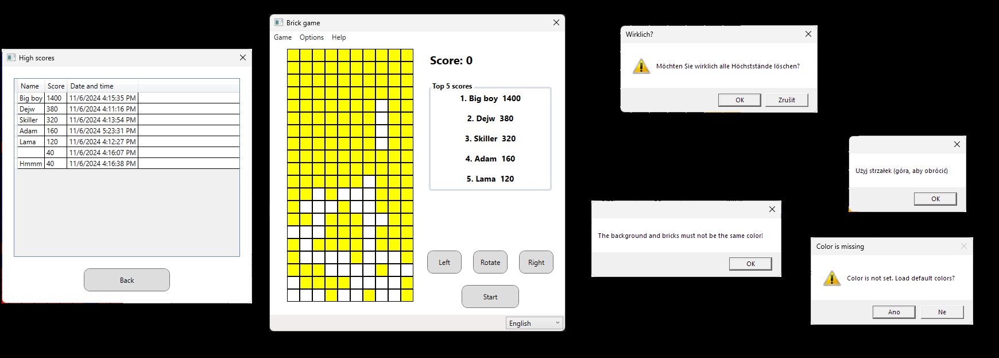

# Brick game (inspired by Tetris)

A variantion of the popular game. This is non-comercial fan version. 

## Project description

Original Tetris is is a puzzle video game created in 1985 by Alexey Pajitnov, a Soviet software engineer. It has been published by several companies on more than 65 platforms, setting a Guinness world record for the most ported game. After a significant period of publication by Nintendo, in 1996 the rights reverted to Pajitnov, who co-founded the Tetris Company with Henk Rogers to manage licensing.

This project is a variation of the popular game Tetris. It is a non-commercial fan version created for self-representation purposes, demonstrating my skills in C# using WPF. 

You can change dimensions of game board, bricks, speed of falling and colors of grid, bricks and background. Game is available in Czech, Polish, German and English. I am sorry, if is there any mistakes in translation(Chat GPT helped me with it).
Settings and high scores are saved to files(txt, xml). You can delete high scores. You can see all scores, not only top 5. And the music, that plays in the background to keep you relaxing while playing.

## Project lanuch

Just run in your favorite compiler with C# support and WPF enabled.

## Dependencies

- .NET 8.0 (or higher)
- Windows Presentation Foundation (WPF)

## Project preview

