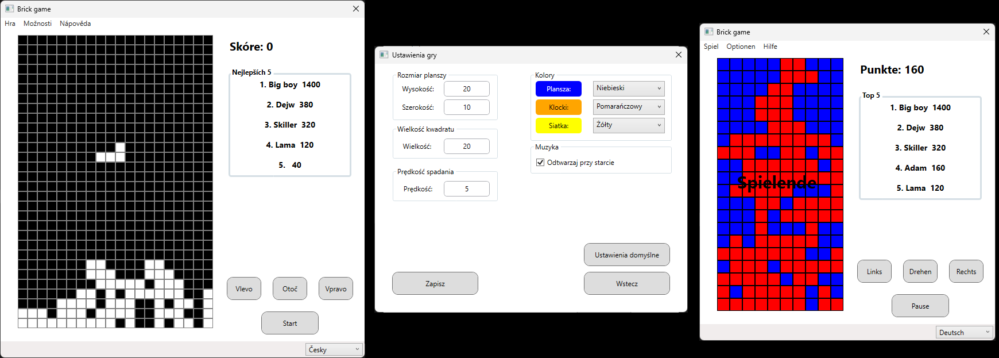

# Brick game (inspired by Tetris)

A variantion of the popular game. This is non-comercial fan version. 

## Project description

Original Tetris is is a puzzle video game created in 1985 by Alexey Pajitnov, a Soviet software engineer. It has been published by several companies on more than 65 platforms, setting a Guinness world record for the most ported game. After a significant period of publication by Nintendo, in 1996 the rights reverted to Pajitnov, who co-founded the Tetris Company with Henk Rogers to manage licensing.

This project is a variation of the popular game Tetris. It is a non-commercial fan version created for self-representation purposes, demonstrating my skills in C# using WPF. 
You can change dimensions of game board, bricks and also speed of falling. Game is in Czech and English.

## Project lanuch

Just run in your favorite compiler with C# support and WPF enabled.

## Project preview

